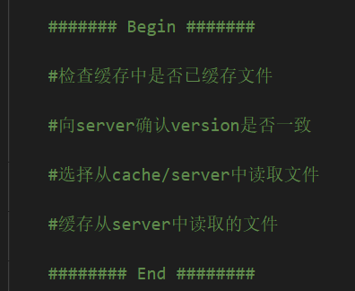

# 作业题说明

来自头歌的任务要求页面。

## 1 Paxos

相关代码和说明在文件夹 `paxos` 中。

### 1.1 任务描述

根据 Paxos 算法流程完成相关核心成员函数设计。

### 1.2 相关知识

在学习之前, 我们可以先了解一下相关概念知识。

#### 1.2.1 角色

在 Paxos 算法中有以下几个角色:

提议者`(proposer)`: 进行提议的角色;
批准者`(acceptor)`: 通过提议的角色;
学习者`(learner)`: 感知`(learn)`被选中的提议。
在具体的实现中, 一个进程可能同时充当多种角色。比如一个进程可能既是 Proposer 又是 Acceptor 又是 Learner。

#### 1.2.2 提案

还有一个很重要的概念叫提案 ( Proposal ) 。最终要达成一致的 value 就在提案里。
Proposer 可以提出 ( propose ) 提案;  Acceptor 可以接受 ( accept ) 提案; 如果某个提案被选定 ( chosen ) , 那么该提案里的 value 就被选定了。

**选定提案**
在何种情况下不同的进程认为提案被选中了？

1. Proposer : 只要 Proposer 发的提案被 Acceptor 接受,  Proposer 就认为该提案里的 value 被选定了。

2. Acceptor : 只要 Acceptor 接受了某个提案, Acceptor 就认为该提案里的value 被选定了。

3. Learner: Acceptor 告诉 Learner 哪个 value 被选定, Learner 就认为那个 value 被选定。

### 1.3 编程要求

根据提示, 在右侧编辑器中的 begin-end 间补充代码, 根据 Paxos 算法流程完成 Proposer.cpp 和 Acceptor.cpp 中 Proposer 和 Acceptor 类的核心成员函数设计。

### 1.4 测试说明

后台会自动检测你的输出结果, 当与预期输出一致时, 则算通关。

实验正确输出大致如下:


为了便于评测, 后台会对结果进行处理, 处理后的预期输出如下:

```JavaScript{.line-numbers}
最终通过提议值为: 5
```

***

开始你的任务吧, 祝你成功!

## 2 Write through

相关代码和说明在文件夹 `write_through` 中。

### 2.1 任务描述

本关任务: 补充程序实现写穿算法

### 2.2 相关知识

为了完成本关任务, 你需要掌握: 1.分布式文件系统基础概念, 2.写穿算法。

### 2.3 分布式文件系统

+ 从用户的使用角度来看, 分布式文件系统是一个标准的文件系统, 提供了一系列API, 由此进行文件或目录的创建、移动、删除, 以及对文件的读写等操作

+ 从内部实现角度来看, 分布式文件系统还要通过网络管理存储在多个节点上的文件和目录。并且, 同一文件不只是存储在一个节点上, 而是按规则分布存储在一簇节点上, 协同提供服务

### 2.4 写穿算法

当用户在修改高速缓存项 (文件或块) 时, 新的值保存在高速缓存中, 并立即写回到服务器, 当用户读取速缓存项 (文件或块) 时, 需要先和服务端进行文件的version号比对, 如果一致, 直接从高速缓存项cache中读取文件, 如果不一致则从服务器中读取文件并将文件缓存在本地高速cache中。

### 2.5 编程提示

类与函数解释

```JavaScript{.line-numbers}
sim_file 模拟文件条目类
    sim_file.write(data,verion) 向文件条目写入data和version
    sim_file.get_data() 获取文件条目数据, 返回file_name,data,version
    sim_file.get_version() 获取文件version
server 模拟服务器类, 在cache类初始化时绑定为self._target_server, 请使用该变量调用
    server.write(target_file,data,version) 尝试向服务器写入目标文件, 如果目标文件已经存在, 则会覆盖写入
    server.read(target_file) 尝试向服务器读取目标文件, 如果服务器中存在该文件, 则会返回 file_name,data,version
        如果不存在, 则会返回None
    server.get_version(target_file) 尝试向服务器获取目标文件version
cache 模拟高速缓存类 (在实现的函数中时候self调用下列函数)
    cache._get_new_version() 返回一个时间戳作为version
    cache._read_cache(target_file) 尝试从高速缓存中读取目标文件, 
        如果高速缓存中存在该文件, 则会返回 file_name,data,version
        如果不存在, 则会返回None 
    cache._write_cache(target_file,data,version) 尝试向高速缓存中写入目标文件, 如果目标文件已经存在, 则会覆盖写入
        cache._search_cache(target_file)在高速缓存中检索文件是否已经缓存
注意:
    测试数据确保不会出现读取服务器不存在的文件
    测试程序不存在也不要求高速缓存换出的情况
    请勿直接操作cache类和server类私有变量(除了调用_target_server外)
```

### 2.6 编程要求

根据提示, 在右侧编辑器补充代码, 根据cache.py中的提示完成cache类的读和写程序

读函数编写



写函数编写


### 2.7 测试说明

平台会对你编写的代码进行测试:

测试输入解释: 第一行两个数字分别代表读写的操作次数m和用户数量n。接下来的m行中每一行分为读和写两种操作类型, 当操作类型是“write”时, 后面三个参数分别是用户编号、文件编号、写入的文件数据 (int类型) ; 当操作类型是“read”时, 后面两个参数分别是用户编号、文件编号。

在程序实际运行中, 你并不需要对输入进行处理, 测试程序会处理输入并按照输入调用cache类的read和write函数

测试输出解释: 每一行的数字是每个“read”操作后返回的文件数据 (int类型)

**测试输入样例:**

```shell
5 2
write 0 0 10
read 0 0
read 1 0
write 1 0 5
read 0 0
```

**预期输出:**

```shell
10
10
5
```

***

开始你的任务吧, 祝你成功!
